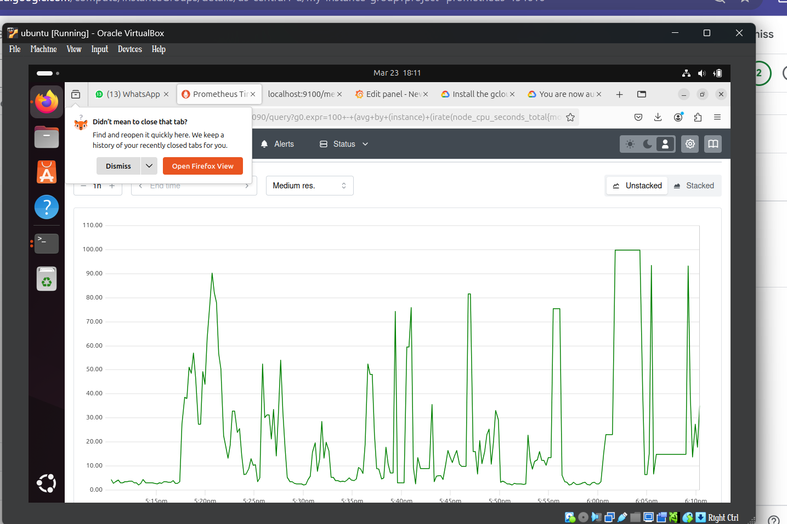
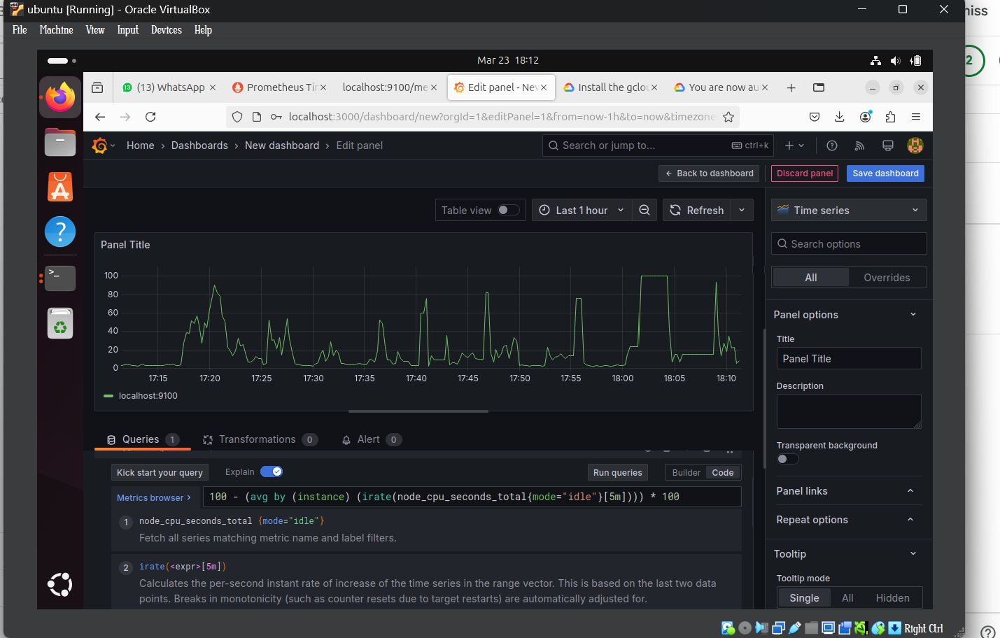

---

# Comprehensive Assignment Report

- Roll no. - B22CS055
- Name:- Aditya Trivedi

## Table of Contents
1. [Introduction](#introduction)
2. [Environment Setup and Prerequisites](#environment-setup-and-prerequisites)
3. [Local Virtual Machine (VM) Setup](#local-vm-setup)
4. [Prometheus Setup and Configuration](#prometheus-setup)
5. [Node Exporter Setup](#node-exporter-setup)
6. [Grafana Setup and Dashboard Configuration](#grafana-setup)
7. [GCP Project and gcloud CLI Configuration](#gcp-project-and-gcloud-cli)
8. [GCP Instance Template and Managed Instance Group (MIG)](#gcp-instance-template-and-mig)
9. [Autoscaling Script Development](#autoscaling-script)
10. [Testing and Demonstration](#testing-and-demonstration)
11. [Challenges and Difficulties Encountered](#challenges)
12. [Conclusion and Future Improvements](#conclusion)
13. [Appendix: Commands and Configuration Files](#appendix)

---

## 1. Introduction

In this assignment, I developed a complete solution that integrates a local Linux VM running resource monitoring tools (Prometheus, Node Exporter, and Grafana) with Google Cloud Platform (GCP) auto-scaling capabilities. The goal was to monitor the resource usage on the local VM and trigger an autoscaling event on GCP when CPU usage exceeds 75%. This report documents every step of the process—from the setup of the VM to the final integration and testing of the autoscaling mechanism.

---

## 2. Environment Setup and Prerequisites

### Prerequisites:
- **Local Environment:**
  - A Windows machine with gcloud CLI installed.
  - A Linux VM (using VirtualBox) running on a host machine.
- **Software and Tools:**
  - **Oracle VirtualBox** for virtualization.
  - **Prometheus** for monitoring metrics.
  - **Node Exporter** for exposing system metrics.
  - **Grafana** for visualizing the metrics.
  - **Stress tool** to simulate high CPU usage.
  - **Google Cloud SDK (gcloud CLI)** for GCP configuration and autoscaling management.
  - **Python 3** with `psutil` installed for custom autoscaling script.

### Installation Summary:
- **gcloud CLI** was installed on both Windows (for initial setup) and on the Linux VM (to execute autoscaling commands).
- **Prometheus**, **Node Exporter**, and **Grafana** were installed on the Linux VM.
- A separate GCP project was created for managing the instance groups and autoscaling.

---

## 3. Local Virtual Machine (VM) Setup

### Steps:
1. **Installing VirtualBox on Linux Host:**
   - Downloaded VirtualBox from the [official website](https://www.virtualbox.org/wiki/Linux_Downloads).
   - Installed VirtualBox using:
     ```bash
     sudo apt update
     sudo apt install virtualbox
     ```

2. **Creating the Virtual Machine:**
   - Opened VirtualBox and clicked “New.”
   - Named the VM `LocalMonitoringVM` and selected the Linux OS type (Ubuntu 64-bit).
   - Allocated 2 CPUs and 4GB of RAM.
   - Created a new virtual hard disk (dynamic allocation, 20GB recommended).

3. **Installing Ubuntu Server on the VM:**
   - Downloaded the latest Ubuntu Server ISO from [Ubuntu’s official website](https://ubuntu.com/download/server).
   - Attached the ISO to the VM’s optical drive.
   - Booted the VM and followed the installation wizard.
   - Performed system update:
     ```bash
     sudo apt update && sudo apt upgrade -y
     ```

### Difficulties Encountered:
- **Network Configuration:**  
  Initially faced issues with the VM’s network settings (NAT vs. Bridged). Switching to Bridged Adapter resolved connectivity problems when accessing the VM from the host.

---

## 4. Prometheus Setup and Configuration

### Steps:
1. **Download Prometheus:**
   - Downloaded the Prometheus tar.gz file from [Prometheus Downloads](https://prometheus.io/download/).
   - Command used:
     ```bash
     wget https://github.com/prometheus/prometheus/releases/download/v2.x.x/prometheus-2.x.x.linux-amd64.tar.gz
     ```
   - Extracted the tarball:
     ```bash
     tar xvfz prometheus-2.x.x.linux-amd64.tar.gz
     ```

2. **Navigating to Prometheus Directory and Running Prometheus:**
   - Changed directory:
     ```bash
     cd prometheus-2.x.x.linux-amd64
     ```
   - Started Prometheus with the default configuration:
     ```bash
     ./prometheus --config.file=prometheus.yml
     ```

3. **Verification:**
   - Accessed the Prometheus web interface via [http://localhost:9090](http://localhost:9090).

### Configuration Changes:
- The default `prometheus.yml` file was used initially. Later, it was updated to include Node Exporter targets and alerting rules (see Section 5).

### Difficulties Encountered:
- **Port Conflicts:**  
  Initially, a port conflict occurred with another service running on port 9090. This was resolved by stopping the conflicting service.

---

## 5. Node Exporter Setup

### Steps:
1. **Download and Extract Node Exporter:**
   - Downloaded Node Exporter from its [GitHub releases page](https://github.com/prometheus/node_exporter/releases).
   - Command:
     ```bash
     wget https://github.com/prometheus/node_exporter/releases/download/v1.x.x/node_exporter-1.x.x.linux-amd64.tar.gz
     tar xvfz node_exporter-1.x.x.linux-amd64.tar.gz
     cd node_exporter-1.x.x.linux-amd64
     ```

2. **Start Node Exporter:**
   - Ran the following command:
     ```bash
     ./node_exporter &
     ```
   - Verified by visiting [http://localhost:9100/metrics](http://localhost:9100/metrics).

### Update Prometheus Configuration:
- Modified `prometheus.yml` to add Node Exporter as a target:
  ```yaml
  scrape_configs:
    - job_name: 'prometheus'
      static_configs:
        - targets: ['localhost:9090']

    - job_name: 'node'
      static_configs:
        - targets: ['localhost:9100']
  ```
- Reloaded Prometheus configuration:
  ```bash
  curl -X POST http://localhost:9090/-/reload
  ```

### Difficulties Encountered:
- **Path Issues:**  
  Initially, the Node Exporter binary did not have execution permissions. This was resolved with:
  ```bash
  chmod +x node_exporter
  ```

---

## 6. Grafana Setup and Dashboard Configuration

### Steps:
1. **Install Grafana:**
   - For Ubuntu, added the Grafana APT repository and installed:
     ```bash
     sudo apt-get install -y software-properties-common
     wget -q -O - https://packages.grafana.com/gpg.key | sudo apt-key add -
     echo "deb https://packages.grafana.com/oss/deb stable main" | sudo tee -a /etc/apt/sources.list.d/grafana.list
     sudo apt-get update
     sudo apt-get install grafana
     ```
   - Started Grafana:
     ```bash
     sudo systemctl start grafana-server
     sudo systemctl enable grafana-server
     ```

2. **Configure Grafana:**
   - Accessed Grafana at [http://localhost:3000](http://localhost:3000).
   - Default credentials (admin/admin) were used for the initial login.
   - Added Prometheus as a data source:
     - URL: `http://localhost:9090`
     - Tested and saved the data source.

3. **Creating a Dashboard:**
   - Created a new dashboard and added panels.
   - Example query: `node_cpu_seconds_total` to display CPU metrics.

### Difficulties Encountered:
- **Data Source Connection:**  
  Initial connection issues with Prometheus as a data source were resolved by ensuring proper network accessibility between Grafana and Prometheus.

---

## 7. GCP Project and gcloud CLI Configuration

### Steps:
1. **GCP Project Setup:**
   - Created a new project in the GCP Console.
   - Enabled billing and necessary APIs (Compute Engine API).

2. **gcloud CLI Setup on Windows and Linux VM:**
   - Installed gcloud CLI following [Google’s installation guide](https://cloud.google.com/sdk/docs/install).
   - Ran:
     ```bash
     gcloud init
     ```
   - Selected the created project and configured default settings.

### Difficulties Encountered:
- **Authentication Issues:**  
  On the Linux VM, initial gcloud authentication required opening a URL in a browser. This was handled by using a device code flow provided by gcloud.

---

## 8. GCP Instance Template and Managed Instance Group (MIG)

### Instance Template Creation:
- Ran the following command on the Linux VM (with gcloud configured):
  ```bash
  gcloud compute instance-templates create my-instance-template \
      --machine-type=n1-standard-1 \
      --image-family=debian-10 \
      --image-project=debian-cloud \
      --boot-disk-size=10GB
  ```
- This template defined the VM characteristics (machine type, OS, disk size).

### Managed Instance Group (MIG) Creation:
- Created the MIG with:
  ```bash
  gcloud compute instance-groups managed create my-instance-group \
      --base-instance-name=my-instance \
      --size=1 \
      --template=my-instance-template \
      --zone=us-central1-a
  ```
- Verified the MIG in the GCP Console under **Compute Engine > Instance groups**.

### Autoscaling Configuration:
- Configured autoscaling on the MIG:
  ```bash
  gcloud compute instance-groups managed set-autoscaling my-instance-group \
      --max-num-replicas=5 \
      --target-cpu-utilization=0.75 \
      --cool-down-period=60 \
      --zone=us-central1-a
  ```
- This command instructs GCP to scale up to 5 instances when CPU utilization exceeds 75%.

### Difficulties Encountered:
- **Zone Mismatch:**  
  Initially, instances were being created in an incorrect zone due to misconfigured parameters. Ensured consistency by setting the zone explicitly in each command.

---

## 9. Autoscaling Script Development

### Direct Script Approach:
I chose to implement a Python script running on the Linux VM (with gcloud CLI installed) that monitors CPU usage via the `psutil` module and calls the GCP autoscaling command.

### Script Details:
- **Script Name:** `autoscale_monitor.py`
- **Dependencies:** Python 3, psutil (`pip install psutil`)
- **Logic:**
  - Monitor CPU usage at 10-second intervals.
  - If usage > 75%, query the current size of the MIG.
  - If the size is below the maximum (5), increment the group size by 1.
  - Include a cooldown period (60 seconds) after each scaling event.

### Script Code:
```python
import psutil
import subprocess
import time

# Configuration variables
THRESHOLD = 75.0          # CPU usage percentage to trigger scaling
MAX_SIZE = 5              # Maximum number of instances in the MIG
ZONE = "us-central1-a"    # Change as needed for your MIG
MIG_NAME = "my-instance-group"
COOLDOWN = 60             # Cooldown period in seconds after a scaling event

def get_current_mig_size():
    """Retrieve the current target size of the Managed Instance Group."""
    try:
        result = subprocess.check_output([
            "gcloud", "compute", "instance-groups", "managed", "describe", MIG_NAME,
            "--zone", ZONE,
            "--format=value(targetSize)"
        ])
        return int(result.decode("utf-8").strip())
    except subprocess.CalledProcessError as e:
        print("Error retrieving MIG size:", e)
        return None

def resize_mig(new_size):
    """Resize the Managed Instance Group to the new size using gcloud CLI."""
    try:
        print(f"Resizing MIG {MIG_NAME} to {new_size} instances...")
        subprocess.check_call([
            "gcloud", "compute", "instance-groups", "managed", "resize", MIG_NAME,
            "--size", str(new_size),
            "--zone", ZONE
        ])
        print("Resize command executed successfully.")
    except subprocess.CalledProcessError as e:
        print("Error executing resize command:", e)

def monitor_and_scale():
    while True:
        # Measure CPU usage over an interval of 10 seconds
        cpu_usage = psutil.cpu_percent(interval=10)
        print(f"Current CPU Usage: {cpu_usage}%")

        if cpu_usage > THRESHOLD:
            print("Threshold exceeded! Checking current MIG size...")
            current_size = get_current_mig_size()
            if current_size is None:
                print("Skipping scaling due to error retrieving MIG size.")
            elif current_size >= MAX_SIZE:
                print(f"MIG is already at maximum size ({MAX_SIZE}). No scaling performed.")
            else:
                new_size = current_size + 1
                print(f"Scaling from {current_size} to {new_size} instances.")
                resize_mig(new_size)
                print(f"Cooling down for {COOLDOWN} seconds to allow scaling to take effect.")
                time.sleep(COOLDOWN)
        else:
            print("CPU usage is within limits. No scaling needed.")

        # Sleep before the next check (adjust as needed)
        time.sleep(10)

if __name__ == "__main__":
    monitor_and_scale()
```

### Execution:
- Run the script on the Linux VM:
  ```bash
  python3 autoscale_monitor.py
  ```
- Verified that when running `stress --cpu 4 --timeout 120`, the script successfully triggered scaling commands on GCP.

### Difficulties Encountered:
- **Script Permissions and Environment:**  
  Ensured that the script had the correct permissions and that the gcloud CLI was available in the environment’s PATH.
- **Gcloud CLI Command Output Parsing:**  
  Occasionally, errors in parsing the MIG size were encountered; these were resolved by validating the output format.

---

## 10. Testing and Demonstration

### Steps for Testing:
1. **Baseline Monitoring:**
   - Verified Prometheus and Grafana were correctly displaying metrics from Node Exporter.
   - Confirmed local endpoints:
     - Prometheus: [http://localhost:9090](http://localhost:9090)
     - Node Exporter: [http://localhost:9100/metrics](http://localhost:9100/metrics)
     - Grafana: [http://localhost:3000](http://localhost:3000)

2. **Stress Test:**
   - Ran:
     ```bash
     sudo apt-get install stress
     stress --cpu 4 --timeout 120
     ```
   - Monitored CPU usage via Prometheus and Grafana.
   - Observed the autoscaling script detecting high CPU usage and issuing a gcloud CLI command to increase the MIG size.

3. **GCP Verification:**
   - Logged into the GCP Console and verified that the Managed Instance Group size increased accordingly.
   - Reviewed logs from the autoscaling script to ensure commands were executed successfully.

---

## 11. Challenges and Difficulties Encountered

### VM Setup:
- **Networking Issues:**  
  Initially encountered connectivity problems due to incorrect network adapter settings. Resolved by switching from NAT to Bridged Adapter.

### Prometheus and Node Exporter:
- **Permission Issues:**  
  Node Exporter required correct execution permissions.
- **Port Conflicts:**  
  Resolved conflicts when another service was using Prometheus default port.

### Grafana:
- **Data Source Configuration:**  
  Faced temporary connectivity issues with Prometheus that were resolved by checking firewall and network settings.

### GCP and gcloud CLI:
- **Authentication Flow:**  
  The gcloud CLI required a device code flow on the Linux VM; this was an extra step that required browser authentication.
- **Zone Consistency:**  
  Initially, autoscaling commands were misdirected due to zone mismatches.

### Autoscaling Script:
- **Parsing CLI Output:**  
  Ensured correct parsing of the gcloud CLI output for the MIG size.
- **Cooldown Logic:**  
  Implemented a cooldown period to prevent rapid, repeated scaling events.

---

## 12. Conclusion and Future Improvements

This project successfully integrates a local monitoring stack (Prometheus, Node Exporter, and Grafana) with GCP autoscaling, triggered via a custom Python script. The assignment demonstrated:
- Setting up a local VM and installing necessary monitoring tools.
- Configuring Prometheus and Grafana to monitor system metrics.
- Setting up a GCP project, instance template, and Managed Instance Group.
- Developing a Python script to trigger autoscaling based on CPU usage.
- Testing the end-to-end flow using the stress tool to simulate high load.

### Future Improvements:
- **Enhanced Logic:**  
  Implement dynamic scaling (both up and down) based on additional metrics.
- **Alerting Integration:**  
  Consider using Prometheus Alertmanager and webhooks for a more event-driven approach.
- **Logging and Monitoring:**  
  Enhance logging within the autoscaling script for better diagnostics.
- **Security Hardening:**  
  Secure the gcloud CLI environment and API keys.

---

## 13. Appendix: Commands and Configuration Files

### Prometheus Configuration (`prometheus.yml`):
```yaml
global:
  scrape_interval: 15s

scrape_configs:
  - job_name: 'prometheus'
    static_configs:
      - targets: ['localhost:9090']

  - job_name: 'node'
    static_configs:
      - targets: ['localhost:9100']
```

- Output




### Node Exporter Setup:
```bash
wget https://github.com/prometheus/node_exporter/releases/download/v1.x.x/node_exporter-1.x.x.linux-amd64.tar.gz
tar xvfz node_exporter-1.x.x.linux-amd64.tar.gz
cd node_exporter-1.x.x.linux-amd64
chmod +x node_exporter
./node_exporter &
```

### Grafana Installation Commands:
```bash
sudo apt-get install -y software-properties-common
wget -q -O - https://packages.grafana.com/gpg.key | sudo apt-key add -
echo "deb https://packages.grafana.com/oss/deb stable main" | sudo tee -a /etc/apt/sources.list.d/grafana.list
sudo apt-get update
sudo apt-get install grafana
sudo systemctl start grafana-server
sudo systemctl enable grafana-server
```


### GCP CLI and MIG Commands:
```bash
gcloud init
gcloud config set project YOUR_PROJECT_ID

gcloud compute instance-templates create my-instance-template \
    --machine-type=n1-standard-1 \
    --image-family=debian-10 \
    --image-project=debian-cloud \
    --boot-disk-size=10GB

gcloud compute instance-groups managed create my-instance-group \
    --base-instance-name=my-instance \
    --size=1 \
    --template=my-instance-template \
    --zone=us-central1-a

gcloud compute instance-groups managed set-autoscaling my-instance-group \
    --max-num-replicas=5 \
    --target-cpu-utilization=0.75 \
    --cool-down-period=60 \
    --zone=us-central1-a
```

### Autoscaling Script (`autoscale_monitor.py`):
*(Refer to Section 9 for full code.)*

---
